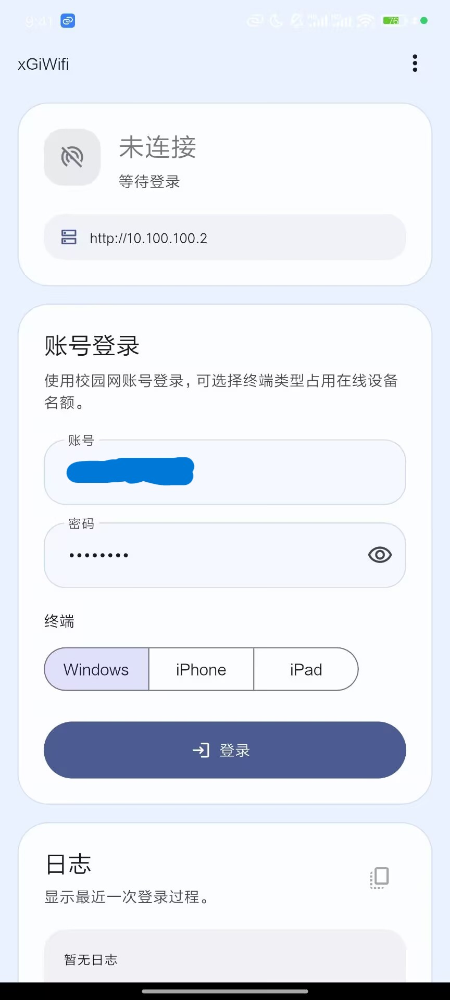
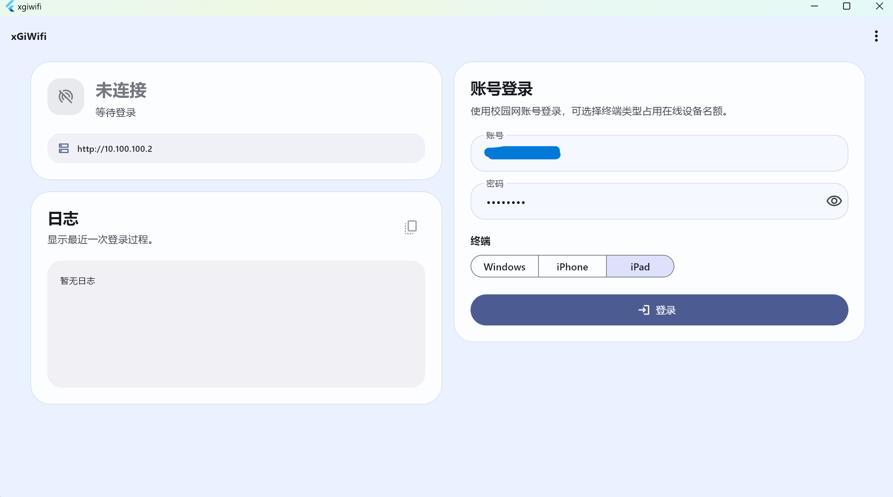

    

    <h1>xGiWifi</h1>

使用Flutter实现的第三方GiWiFi客户端，可以将任何设备包装成某个终端登录，以节省名额，支持Android、Windows、Linux等多个平台

 
 
 
 

## 预览

    <table>
        <tr>
            <td align="center">
                <b>Android</b>  
                
            </td>
            <td align="center">
                <b>Windows</b>  
                
            </td>
        </tr>
    </table>

## 功能

- 支持模拟登陆

- 支持换绑

## 下载

可以通过右侧release进行下载或拉取代码到本地进行编译

## 注意

- 仅对山东科技大学GiWifi测试！

- 程序不会自动检查所连WiFi是否为GiWiFi，也不会检查当前究竟真的是否使用WiFi上网！

## 参考

查看另一个使用shell模拟登录的项目：[Giwifi_autoLogin](https://github.com/Mhenwa/Giwifi_autoLogin)

## 声明

仅供学习交流，严禁用于商业用途，请于24小时内删除！
